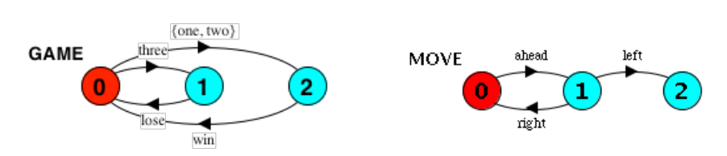
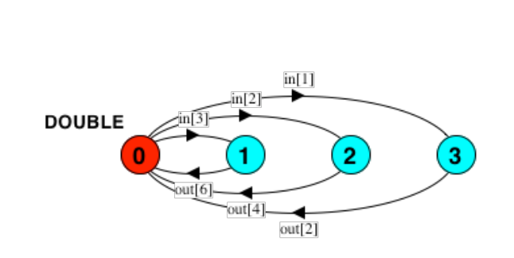
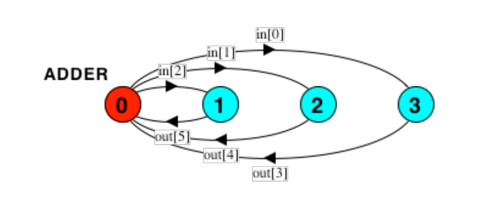

# 2 From LTS to FSP

## 2.1

For each of the following processes, give the Finite State Process (FSP) description of the Labelled Transition System (LTS). The FSP descriptions may be checked by generating the corresponding state machines with LTSA.





1. ```FSP
   GAME = ({one, two} -> win -> GAME | three -> lose -> GAME).
   ```

2. ```FSP
   MOVE = (ahead -> (right -> MOVE | left -> STOP)).
   ```

3. ```FSP
   range T = 1..3
   DOUBLE = (in[i:T] -> out[2 * i] -> DOUBLE).
   ```

## 2.2

Give the Finite State Process (FSP) description of the following process. The process represents an adder which adds the constant k = 3 to the input which ranges between 0 and 2. Give also a parametrized form of the process allowing an easy change of the value of k.



```FSP
const K = 3
range T = 0..2
ADDER(K=K) = (in[i:T] -> out[i + K] -> ADDER).
```

# 3 Modeling

## 3.1

 A bitstable digital circuit receives a sequence of trigger inputs and alternatively outputs 0 and 1. Model the process BITSTABLE using FSP, and check that it produces the required output; i.e, it should perform the actions given by the trace: `trigger -> o[0] -> trigger -> o[1] -> trigger -> o[0] -> trigger -> o[1] ...`

```FSP
BITSTABLE = (trigger -> o[0] -> trigger -> o[1] -> BITSTABLE).
```

Model also a parametrized version that produces values from 0 to the parameter K and continues from 0 afterwards; for K = 2, it should perform the actions given by the trace: `trigger -> o[0] -> trigger -> o[1] -> trigger -> o[2] -> trigger -> o[0] ...`

```FSP
const N = 2
BITSTABLE(N=N) = TRIGGER[0],
TRIGGER[x:0..N] = (trigger -> o[x] -> TRIGGER[(x+1) % (N+1)]).
```

## 3.2

A variable stores values in the range 0..N and supports the actions read and write. Model the variable as a process, VARIABLE, using FSP. For N = 2, check that it can perform the actions given by the trace:` write.2 -> read.2 -> read.2 -> write.1 -> write.0 -> read.0`

```FSP
const N = 2
VARIABLE(N=N) = VARIABLE[0],
VARIABLE[x:0..N] = (write[y:0..N] -> VARIABLE[y] | read[x] -> VARIABLE[x]).
```

## 3.3

A miniature portable FM radio has three controls. An on/off switch turns the device on and off. Tuning is controlled by two buttons scan and reset which operate as follows. When the radio is turned on or reset is pressed, the radio is tuned to the top frequency of the FM band (108 MHz). When scan is pressed, the radio scans towards the bottom of the band (88 MHz). It stops scanning when it locks on to a station or it reaches the bottom (end). If the radio is currently tuned to a station and scan is pressed then it starts to scan from the frequency of that station towards the bottom. Similarly, when reset is pressed the receiver tunes to the top. Using the alphabet {on, off, scan, reset, lock, end}, model the FM radio as an FSP process, RADIO.

```FSP
const TOP = 108
const BOTTOM = 88
range T = BOTTOM..TOP
RADIO = OFF,
OFF = (on ->BAND[108]),
BAND[x:T] = (reset -> BAND[108]
           | scan -> SCANNING[x]
           | off -> OFF),
SCANNING[x:T] = ( reset -> BAND[108]
                | off -> OFF
                | end -> ENDBAND
                | lock[y:BOTTOM..x] -> BAND[y]),
ENDBAND = (reset -> BAND[108]
         | off -> OFF).
         
/////////////////////////////////////////////////////////
const Bottom = 88
const Top = 108

RADIO = OFF,
OFF = (on->BAND[Top]),
BAND[i:Bottom..Top] = (reset->BAND[Top]|scan->SCAN[i]|off->OFF),
SCAN[x:Bottom..Top] = (lock[i:Bottom..x]->BAND[i]|end->ENDBOTTOM|off->OFF|reset->BAND[Top]),
ENDBOTTOM = (off->OFF|reset->BAND[Top]).
```

